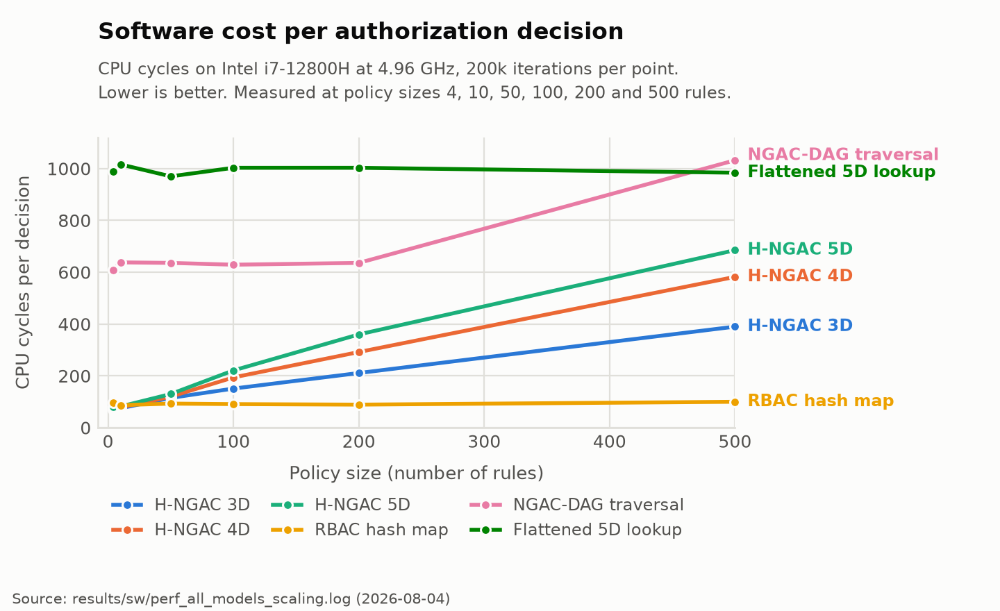
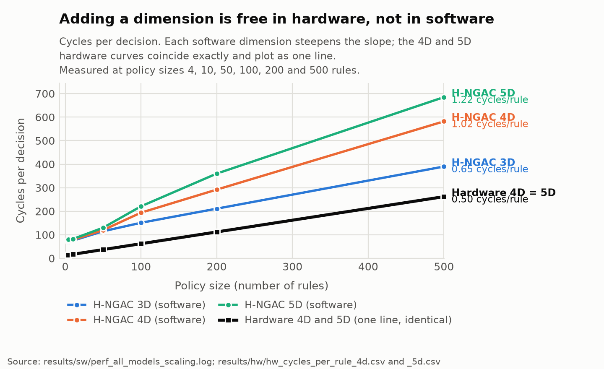

::: {custom-style="ReviewResponse"}
**About this revision.** Everything in dark red with a red bar answers one of your four Word comments. The underlying tables and text have been corrected as well, so the document stands on its own without reading the responses. Note that regenerating the file replaces it, so your original Word comment threads are gone; each comment is quoted verbatim below so nothing is lost.
:::

# What this project is trying to prove

The paper is not "we put NGAC on an FPGA." The claim is about **the cost of security dimensionality**.

H-NGAC compiles an NGAC policy graph into fixed-width bitmasks so an authorization decision becomes a chain of bitwise ANDs. There are three additive variants:

| Variant | Test | Attack class it blocks |
|---|---|---|
| 3D | subject AND object AND attribute | unauthorized access by an unprivileged agent |
| 4D | 3D AND system state | safety interlock bypass, operating in a forbidden state |
| 5D | 4D AND command provenance | injection from a compromised but authenticated node |

The 5D dimension is the interesting one. SROS2 and DDS-Security authenticate *who* a node is at the transport layer. They cannot tell you whether that *kind of source* should be allowed to issue that command to that resource. 5D enforces that at the application layer.

The thesis: **in software, each added dimension costs you real time, and that cost grows with policy size. In hardware, it costs nothing.** Three attack classes for the price of one. That property does not hold on a CPU, which is why the hardware primitive is the contribution.

# Where the project stood before this package

Everything except the hardware was done. The kernel, a 45-test bench, a seven-model software comparison harness, and the ROS2 attack demos (18,878 injections blocked, 0 false positives) were all complete and committed in April.

The hardware claim was explicitly a **placeholder**. `docs/decision-log.md` has a formal 2026-04-26 decision saying no hardware claim may be stated as fact until synthesis reports arrive. `docs/canonical-context.md` reads "Hardware overhead: pending synthesis confirmation." The project has been parked on that dependency for roughly three months.

**Farouq's package closes that dependency.** That is the headline: the paper's central claim moved from pending to measured.

# What he delivered

Vitis HLS 2025.2, target `xc7z020-clg400-1` (Zynq-7020, the PYNQ-Z1 part), 10 ns clock so 100 MHz. Four kinds of evidence:

1. C synthesis reports for 4D and 5D
2. RTL co-simulation, Verilog, both Pass, with per-call transaction latencies
3. Functional verification on actual PYNQ-Z1 silicon
4. Software cycle counts via `perf` hardware counters on an i7-12800H

The 4D and 5D builds differ by **exactly one term**. I diffed them. The only functional change is one added line, `bool prov_ok = provenance_permitted(...)`, and its inclusion in the final AND. Same part, same clock, same testbench, same corpus. This is a properly controlled comparison, which matters a lot for the claim.

He also optimized the kernel from the version in our repo. It now checks two rules per cycle in a two-stage pipeline, so the marginal cost is half a cycle per rule rather than one.

Every number in his results README reproduces exactly when his own extraction scripts are re-run against the raw reports.

# The results

## Hardware cycles per decision, co-simulation measured

4D and 5D are identical at every point. All values are clock cycles of the 100 MHz fabric clock:

| Policy size (rules) | 4D (cycles) | 5D (cycles) | min = avg = max? |
|---|---|---|---|
| 4 | 14 | 14 | yes |
| 10 | 17 | 17 | yes |
| 50 | 37 | 37 | yes |
| 100 | 62 | 62 | yes |
| 200 | 112 | 112 | yes |
| 500 | 262 | 262 | yes |

Two things here are strong. First, the latency has a closed form: **cycles = 12 + rules/2**, exact at every point. You can state the worst case analytically. Second, min equals avg equals max at every rule count. **Zero jitter, not low jitter.**

## What the six comparison models are

::: {custom-style="ReviewResponse"}
**Your comment:** "What are these 'models'?"

**Answer.** They are the six authorization implementations the benchmark runs head to head on one identical request corpus, so the numbers are comparable. Three of them are competing designs from the literature and three are our own variants. The glossary table below is new, and I have also relabeled the cycle table's columns, which previously showed bare numbers 4 through 500 with no indication that they were policy sizes.

**The critical point, which the raw cycle counts hide:** three of the six models are *faster because they are not doing the job*. RBAC hash map looks excellent at 100 cycles, but it never checks state or provenance, so it authorizes requests it should deny. Any table of these numbers must carry the correctness column or it actively misleads. That is now in the table.
:::

| Model | What it is | Correct on this corpus? |
|---|---|---|
| H-NGAC 3D | Our bitmask primitive: subject AND object AND attribute | No, over-authorizes (no state, no provenance) |
| H-NGAC 4D | 3D plus the system state check | No, over-authorizes (no provenance) |
| H-NGAC 5D | 4D plus the command provenance check | **Yes** |
| RBAC hash map | Best-case classical baseline: a packed (subject, object) key into a permission bitmask | No, over-authorizes (no state, no provenance) |
| NGAC-DAG traversal | Standard NGAC done properly: breadth-first search over the policy graph | No, over-authorizes (no state) |
| Flattened 5D direct lookup | Reviewer-fairness baseline: every 5D decision precomputed into one materialized allow-set | **Yes**, but costs 19.7x the memory and 5.2x the reload time |

The comparison that matters is therefore **H-NGAC 5D against the flattened lookup**, since those are the only two that produce correct answers. H-NGAC 5D is faster at every policy size and uses a twentieth of the memory.

## Software cycles per decision

Same corpus, derived as mean nanoseconds times the measured 4.96 GHz clock. Columns are policy sizes in rules:

| Model | 4 | 10 | 50 | 100 | 200 | 500 |
|---|---|---|---|---|---|---|
| H-NGAC 3D | 70 | 75 | 115 | 151 | 211 | 390 |
| H-NGAC 4D | 74 | 78 | 120 | 194 | 292 | 582 |
| H-NGAC 5D | 80 | 82 | 130 | 221 | 360 | 685 |
| RBAC hash map | 97 | 87 | 93 | 91 | 89 | 100 |
| NGAC-DAG traversal | 608 | 638 | 636 | 629 | 636 | 1032 |
| Flattened 5D lookup | 990 | 1016 | 970 | 1003 | 1003 | 984 |

::: {custom-style="ReviewResponse"}
**Your comment:** "This table needs a line chart"

**Answer.** Added below. Two things become visible that the table hides: the three H-NGAC variants fan apart as policy grows, which is the whole software-cost argument, and the two flat lines at the top are the baselines whose cost is dominated by memory access rather than policy size.
:::

{width=7.1in}

## The key finding, now measured

Marginal cost of **one additional policy rule**, in cycles per rule, computed as the slope from 4 rules to 500 rules:

| Implementation | 3D | 4D | 5D | Cost of going 3D to 5D |
|---|---|---|---|---|
| Software (cycles per rule) | 0.645 | 1.024 | 1.220 | **+89%** |
| Hardware (cycles per rule) | not synthesized | 0.500 | 0.500 | **+0%** |

::: {custom-style="ReviewResponse"}
**Your comment:** "Measured in what? 3D said cycles/rule, what about 4D and 5D?"

**Answer.** All six figures are in the same unit, cycles per rule. The old table put the unit only in the first cell, which made it look like the other five were something else. The unit is now in the row labels and every cell is a bare number, so they are unambiguously comparable.

**How to read it:** each value is how many extra clock cycles one more policy rule adds to a decision. Software 5D at 1.220 means every additional rule costs about 1.2 cycles. Hardware 5D at 0.500 means every additional rule costs half a cycle, because the optimized kernel checks two rules per clock. The point of the table is the last column: in software, going from 3D to 5D makes each rule 89% more expensive forever after, while in hardware it changes nothing.

**On the empty 3D hardware cell:** we do not have it. Farouq synthesized 4D and 5D only. This is gap 1 in the list below and it is cheap to close.
:::

{width=7.1in}

In software, adding state and provenance nearly doubles how fast your latency grows with policy size. In hardware it changes nothing at all, because the extra AND terms fold into the same combinational stage.

## What the fifth dimension costs in chip resources

::: {custom-style="ReviewResponse"}
**Your comment:** "What does this mean?" (on the heading "Area cost of the fifth dimension")

**Answer.** "Area" is FPGA shorthand for how much of the chip the design physically occupies. Time cost and area cost are separate budgets on an FPGA: a design can get slower, or bigger, or both. The previous section showed the fifth dimension costs no extra *time*. This section asks what it costs in *space*, which is the question a hardware reviewer will ask next. I have renamed the heading and added a plain-English column.

**The one-sentence version:** the fifth dimension makes the design about 11% larger in logic and costs nothing in time, on a part where the entire design already fits in 9% of the chip. That is the "zero cost" claim stated honestly: free in time, nearly free in space.
:::

| Metric | What it measures | 4D | 5D | Change |
|---|---|---|---|---|
| LUT | Lookup tables, the FPGA's basic logic building block. The main "how big is it" number. | 4580 (8% of chip) | 5104 (9% of chip) | +524, or +11.4% |
| FF | Flip-flops, single-bit storage used for pipeline registers | 2579 (2%) | 2679 (2%) | +100, or +3.9% |
| BRAM | Dedicated on-chip memory blocks | 0 | 0 | none used |
| DSP | Dedicated arithmetic blocks | 0 | 0 | none used |
| Initiation interval | Clock cycles before the pipeline can accept the next request. 1 is the best possible. | 1 | 1 | unchanged |
| Timing slack | Margin left against the 10 ns clock. Positive means it meets timing. | 0.33 ns | 0.33 ns | unchanged |

Zero BRAM and zero DSP is worth stating in the paper. It means the primitive is pure combinational bitwise logic with registers, consuming none of the scarce dedicated blocks that the rest of a robotics SoC design competes for.

## Board verification on silicon

2,307 requests across the six rule counts, all PASS, allow and deny counts matching C simulation and co-simulation exactly.

# One thing to decide before writing the abstract

Farouq's recommendation to report cycles is right, but it needs to be argued in the paper rather than assumed, because of this:

At 500 rules the hardware takes 262 cycles at 100 MHz, which is 2.62 microseconds. The software takes 685 cycles at 4.96 GHz, which is 138 nanoseconds. **In wall-clock mean latency the laptop CPU beats the FPGA by about 19x.** A reviewer will do that arithmetic in about ten seconds, so the paper has to get there first.

The defensible framing is worst case, not mean, and it is genuinely excellent:

| Policy size (rules) | SW 5D worst observed | HW 5D worst (= best) | HW advantage |
|---|---|---|---|
| 4 | 298.8 us | 0.14 us | 2134x |
| 50 | 117.9 us | 0.37 us | 319x |
| 200 | 355.4 us | 1.12 us | 317x |
| 500 | 17.2 us | 2.62 us | 6.6x |

Software standard deviation ranges from 7.9 ns to 804.7 ns depending on run. Hardware standard deviation is exactly zero. The software tail is also erratic and non-monotonic in policy size, which is the point: it is OS scheduling noise, and it is unbounded by construction. This lines up with the framing rule already in `docs/canonical-context.md` about the 157 us DCAS outlier.

So the argument is: **hardware is not faster on average, it is bounded**, and the bound is a closed-form function of policy size. For a real-time robotics deadline, a guaranteed 2.62 us beats an average of 138 ns with a 355 us tail. Add to that the fact that the fabric costs 9% of a small Zynq and frees the CPU entirely.

# Gaps to close or disclose

1. **No 3D synthesis.** The canonical claim says 3D, 4D and 5D resolve identically. We have 4D and 5D. Either run one more C synthesis for 3D, which is cheap since it needs no co-simulation, or narrow the claim to 4D versus 5D. Recommend running it. This is also the empty cell in the key finding table.

2. **The software baseline is a 4.96 GHz i7 while the fabric is a 100 MHz Zynq.** The strongest available fix is nearly free: the PYNQ-Z1 has a 650 MHz ARM Cortex-A9 sitting right next to the fabric, and the board is already up. Running the same benchmark there gives an apples-to-apples embedded comparison where the fabric wins on cycles and wall clock. That single run would make the cycle argument concrete instead of rhetorical.

3. **Two different software cycle numbers exist in the same log.** The README table uses nanoseconds times clock, giving 70 cycles for 3D at 4 rules. The benchmark also emits a direct `CYCLES|` line reading 82.29 for the same case. Pick one method and state it, or the difference will get noticed.

4. **The board test is functional only.** It proves correctness on silicon, not timing. That is fine, but say so plainly rather than letting the board result borrow credibility from the co-simulation timing.

5. **Farouq modified the benchmark harness.** His version takes rule count and model name as arguments; ours takes two arguments and has no `CYCLES` output. His changes need to come back into the repo or the results are not reproducible from our tree.

6. **None of this is in git.** The package is 9 MB and untracked. The standing rule is that experimental results and methodology are mandatory in git. The 4 MB bitstream is the only bulky item and it is worth keeping.

# Timing

The portfolio `CLAUDE.md` records the IPCCC 2026 submission deadline as **7 August 2026, which is today.** Confirm whether that is the abstract deadline or the full paper deadline, because it changes what happens next.

# Suggested next step

Commit the package first so the evidence is safe and reproducible, then draft the abstract. The abstract writes itself from the marginal-cost table plus the zero-jitter result, and neither depends on the gaps above.

# Evidence index

| Claim | Source file in `hngac-package-from-farouq/` |
|---|---|
| Per-call kernel cycles | `results/cosim-opt-v1-{4d,5d}/cosim_report/verilog/result.transaction.rpt` |
| II=1, LUT/FF utilization | `results/cosim-opt-v1-{4d,5d}/syn_report/csynth.rpt` |
| Co-simulation pass and aggregate latency | `results/cosim-opt-v1-{4d,5d}/cosim_report/hngac_authorize_cosim.rpt` |
| Software per-decision cycles | `results/sw/perf_all_models_scaling.log` |
| Software environment | `results/sw/system-snapshot.txt` |
| 2,307 requests PASS on silicon | `board-test/opt-v1-5d-pynqz1-vitis2025.2/board-verification-run.txt` |
| 4D vs 5D single-term difference | `synthesis/opt-v1-{4d,5d}-zynq-2rule-vitis2025.2/src/hngac_kernel.cpp` |
| Chart data, software | `results/sw/sw_cycles.csv` |
| Chart data, hardware | `results/hw/hw_cycles_per_rule_4d.csv` and `_5d.csv` |
